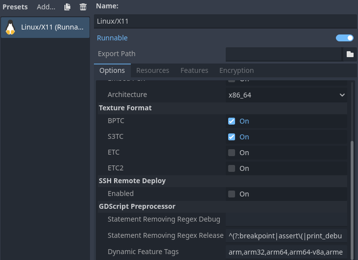

# gdscript-preprocessor

An export plugin for stripping comments and "conditional compilation" of GDScript.

Compatible with Godot **4.6.x**. Should be ready for production use. Please report if you find any bugs.

## How to use

1. Copy the `addons/gdscript_preprocessor` folder to your project.
2. Enable the plugin in the Project Settings.
3. Export the project.

The original scripts will not be changed, but in PCK/ZIP the scripts will be changed.
Use ZIP to check to check the result. If any errors occurred during the export,
you will see them in the Output Log.

> [!TIP]
> Since 4.3, Godot supports exporting GDScript in binary mode out of the box. If your goal
> is just to strip comments from the exported project, you may not need to use this plugin.

> [!IMPORTANT]
> If you are interested in features like conditional compilation and therefore want to use
> this plugin, please note that it exports GDScript as text, regardless of the selected
> export mode. But you should not lose much from this, the binary mode does not provide
> significant obfuscation.

## Settings

You can change the settings in the Options tab of the Export dialog:

<details>
<summary>Screenshot</summary>



</details>

> [!NOTE]
> Each supported platform has certain standard feature tags (plus any custom tags you specify
> in the export preset). However, there are some standard tags that are not known in advance.
> See [godotengine/godot#76990](https://github.com/godotengine/godot/issues/76990) and
> [godotengine/godot#76996](https://github.com/godotengine/godot/pull/76996) for details.
> You can specify a list of feature tags that will be treated as dynamic in the export options.

## Features

* Stripping comments.
* Conditional compilation directives (`#~if` and `#~endif`). They work only when exporting
  a project, and have no effect in the editor.
* `if`/`elif`/`else` statements if their conditions contain only `true`, `false`, `and`,
  `or`, `not` and the following functions calls:
  * `Engine.is_editor_hint()`;
  * `OS.is_debug_build()`;
  * `OS.has_feature("feature_tag_name")`.
* Removing statements by regular expression. With default settings, `assert()`, `breakpoint`,
  `print_debug()`, and `print_stack()` are removed in release builds. Also, you can specify
  custom regexes in the export options.

## Limitations

* Built-in scripts are not supported.
* Your code is expected to follow the
  [GDScript style guide](https://docs.godotengine.org/en/stable/tutorials/scripting/gdscript/gdscript_styleguide.html).
  Otherwise, regular expressions and string processing used in the plugin may not work.
* Statements inside lambdas are not processed (except stripping comments).
* No control flow analysis is performed. For example, an early `return` with a constant condition
  will not strip the rest of the function body. However, you can use the preprocessor directives.

## Example

Original script:

```gdscript
extends Node


var a: int
#~if OS.has_feature("debug")
var b: int
#~endif
var c: int


## Comment.
func _ready() -> void:
    # Comment.
    print(1)
    if OS.has_feature("debug"):
        var t: int = a + b
        print("Debug: t = ", t)
    elif OS.has_feature("release"):
        print("Release.")
    else:
        print("Impossible?!")
    print(2)
```

After exporting with the `debug` feature tag:

```gdscript
extends Node
var a: int
var b: int
var c: int
func _ready() -> void:
    print(1)
    if true:
        var t: int = a + b
        print("Debug: t = ", t)
    print(2)
```

After exporting with the `release` feature tag:

```gdscript
extends Node
var a: int
var c: int
func _ready() -> void:
    print(1)
    if true:
        print("Release.")
    print(2)
```
